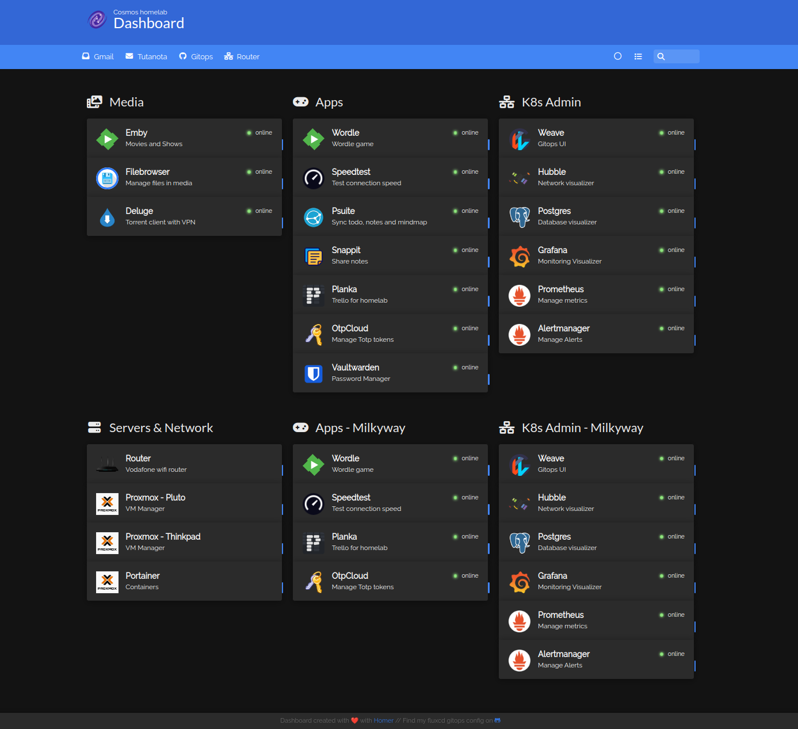

# Homelab K8s

This is where I keep all my kubernetes manifests for my homelab. Here is a screenshot of my homer dashboard.




## Clusters

### Andromeda
A mini pc sitting at my home

### Milkyway
K3s running in hetzner cloud

### Cosmos
Migrated from Andromeda to use cilium as CNI. I moved from bare metal to proxmox LXC and made a copy of the manifests with the name `cosmos`.

## Automation

I used [FluxCD](https://fluxcd.io/) to automate deploying the manifests in the clusters. It follows a gitops style to continuously watch and update the cluster state according to the manifests in git.

### Folder structure

```bash
.
├── bases # Common bases across all clusters
│   ├── apps
│   │   ├── app1 # Application manifests (kustomization or helm)
│   │   │   ├── deployment.yaml
│   │   │   ├── ingress.yaml
│   │   │   ├── kustomization.yaml
│   │   │   └── service.yaml
│   └── infra # Infrastructure components
│       ├── infra-app1
│       │   ├── helm-release.yaml
│       │   ├── helm-repo.yaml
│       │   ├── kustomization.yaml
│       │   └── namespace.yaml
├── clusters
│   ├── cosmos # Customizations specific to cosmos cluster
│   │   ├── apps
│   │   │   ├── app1 # kustomization to apply patches
│   │   │   │   ├── ingress.yaml
│   │   │   │   ├── kustomization.yaml
│   │   │   │   └── secret-sealed.yaml
│   │   ├── bootstrap # FluxCD bootstrap manifests to initialize various components
│   │   │   ├── apps
│   │   │   │   └── app1.yaml
│   │   │   ├── flux-system # FluxCD system components
│   │   │   │   ├── gotk-components.yaml
│   │   │   │   ├── gotk-sync.yaml
│   │   │   │   └── kustomization.yaml
│   │   │   └── infra
│   │   │       ├── 01-cilium.yaml
│   │   │       ├── 02-metallb.yaml
│   │   │       ├── ...
│   │   └── infra # Infra customizations for cosmos
│   │       ├── infra1
│   │       │   └── kustomization.yaml
│   │       ├── infra2
│   │       │   ├── cluster-issuer.yaml
│   │       │   ├── kustomization.yaml
│   │       │   └── secret-sealed.yaml
│   └── milkyway
│       ├── apps
│       ├── bootstrap
│       └── infra
├── kubeseal # Public key for sealed secrets
│   ├── milkyway-sealed-secrets.pem
│   ├── pub-sealed-secrets.pem
│   └── README.md
├── README.md
└── sources # Dockerfiles
    └── 2fauth
        ├── docker-compose.yml
        ├── Dockerfile
        ├── entrypoint.sh
        └── README.md
```

## Sealed secrets

Secrets are encrypted using [sealed-secrets](https://github.com/bitnami-labs/sealed-secrets). The public is present in `kubeseal` folder and private key is present in the cluster.
