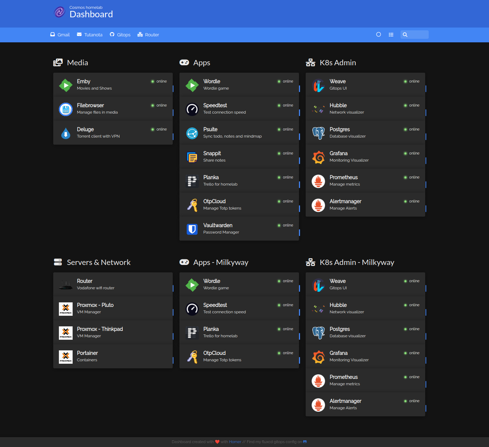

# Homelab K8s

This is where I keep all my kubernetes manifests for my homelab. Here is a screenshot of my homer dashboard.




## Clusters

### Andromeda
A mini pc sitting at my home

### Milkyway
K3s running in hetzner cloud

### Cosmos
Migrated from Andromeda to use Cilium as CNI. Infrastructure moved from bare metal to Proxmox LXC. Manifests are under `clusters/titania/` in Git; the running cluster is named `cosmos` with domain `cosmos.cboxlab.com`.

## Automation

I used [FluxCD](https://fluxcd.io/) to automate deploying the manifests in the clusters. It follows a gitops style to continuously watch and update the cluster state according to the manifests in git.

### Folder structure

```bash
.
├── clusters
│   └── titania
│       ├── apps # Application manifests (kustomization or helm)
│       │   └── <app> # One directory per app
│       │       ├── deployment.yaml
│       │       ├── external-secret.yaml
│       │       ├── kustomization.yaml
│       │       └── svc.yaml
│       ├── bootstrap # FluxCD bootstrap manifests
│       │   ├── apps # Flux Kustomization per app (plus Namespace)
│       │   │   └── <app>.yaml
│       │   ├── flux-system # FluxCD system components
│       │   │   ├── gotk-components.yaml
│       │   │   ├── gotk-sync.yaml
│       │   │   └── kustomization.yaml
│       │   └── infra # Flux Kustomization per infra component
│       │       ├── 01-cilium.yaml
│       │       └── ...
│       └── infra # Infrastructure components
│           └── <component>
│               ├── helm-release.yaml
│               ├── helm-repo.yaml
│               └── kustomization.yaml
├── adrs # Architecture decisions, including Vault and ESO
├── plans # Migration and operational plans
├── kubeseal # Legacy public keys retained during controller decommissioning
└── README.md
```

## Secret management

HashiCorp Vault is the source of truth for application and infrastructure secret values. Namespaced External Secrets Operator resources authenticate with dedicated Kubernetes ServiceAccounts and materialize ordinary Kubernetes Secrets. Git stores only non-secret paths, property mappings, roles, and policies.

No SealedSecret resources remain. The Sealed Secrets controller and legacy public keys are retained temporarily pending a separate removal decision. New SealedSecrets must not be created without an explicitly approved bootstrap exception. See `adrs/0001-vault-external-secrets.md` and `plans/0001-sealed-secrets-to-vault.md`.

## Local repository agent

An opt-in local Pi runner can plan, implement, validate, and independently review repository requirements in an isolated worktree. It stops for explicit human approval before commit, generated-branch push, and pull-request creation; it never merges or pushes to `main`. See `adrs/0002-autonomous-repository-agent.md`, `automation/autonomous-agent/README.md`, and `agent-runs/README.md`.
